# 3DGS论文即相关技术学习笔记

## AI分析概括原文论文

### **1. 研究背景与问题**
辐射场（Radiance Field）方法通过多视角图像重建3D场景并合成新视角，已成为视觉合成领域的重要技术。但现有方法存在明显缺陷：
- **高质量方法（如Mip-NeRF360）**：需训练48小时，渲染速度仅0.071 fps（远非实时）；
- **快速方法（如InstantNGP、Plenoxels）**：训练时间短（5-26分钟），但渲染质量低于前者，且1080p分辨率下无法达到实时（≥30 fps）。

**核心目标**：实现**高质量（媲美Mip-NeRF360）** + **实时渲染（1080p下≥30 fps）** + **训练时间与快速方法相当**。

### **2. 核心创新：3D高斯溅射（3D Gaussian Splatting）**
作者提出三个关键技术，结合了“连续体积表示”的优化优势和“显式点表示”的渲染效率：

#### **（1）3D高斯场景表示**
- **定义**：用3D高斯分布（而非离散点或体素）表示场景，每个高斯由**均值（3D位置）**、**各向异性协方差矩阵（描述形状）**、**不透明度α**、**球谐系数（SH，描述视角相关颜色）** 定义。
- **优势**：
  - 继承连续体积表示的可微性，便于优化；
  - 避免空区域的无效计算（比NeRF的体素采样更高效）；
  - 可投影为2D椭圆“溅射斑（splat）”，通过α混合快速渲染（类似点渲染，但更灵活）。

#### **（2）自适应优化与密度控制**
- **参数优化**：通过梯度下降优化高斯的位置、协方差、α、SH系数，目标是最小化渲染图像与真实图像的差异（损失函数为L1+D-SSIM）。
- **密度控制（动态增删高斯）**：
  - **克隆（Clone）**：对小高斯（欠重建区域），沿位置梯度方向复制，补充细节；
  - **分裂（Split）**：对大高斯（过重建区域），分裂为两个小高斯，提升精度；
  - **裁剪**：移除不透明度α过低的高斯，保持紧凑性。
- **结果**：最终场景由100万-500万个高斯表示，兼顾精度与效率。

#### **（3）快速可见性感知渲染器**
- **核心思路**：基于瓦片（16×16像素）的光栅化，结合GPU快速排序实现高效α混合。
- **步骤**：
  1. 将3D高斯投影到2D图像空间，得到椭圆溅射斑；
  2. 按“瓦片ID+深度”对溅射斑排序（确保可见性顺序）；
  3. 逐瓦片渲染：每个瓦片内按深度顺序混合溅射斑的颜色与不透明度，达到目标不透明度（α≈1）时停止，减少计算。
- **优势**：支持各向异性溅射斑，渲染速度达135 fps（1080p），且反向传播高效（无梯度计算数量限制）。

### **3. 实验结果：性能碾压现有方法**
#### **（1）核心指标对比**
| 方法         | 训练时间 | 渲染速度（fps） | PSNR（质量，越高越好） |
|--------------|----------|-----------------|------------------------|
| Mip-NeRF360  | 48小时   | 0.071           | 24.3                   |
| InstantNGP   | 7分钟    | 9.2             | 22.1                   |
| Plenoxels    | 26分钟   | 8.2             | 21.9                   |
| 本文方法（Ours） | 51分钟 | 135             | 25.2（超Mip-NeRF360）  |

- **质量**：训练51分钟时，PSNR（25.2）略高于Mip-NeRF360（24.3），视觉细节更清晰（如植被、墙面纹理）；
- **速度**：1080p下渲染速度达93-135 fps，远超现有方法；
- **效率**：训练时间与InstantNGP相当（5-51分钟），远低于Mip-NeRF360。

#### **（2）消融实验：各组件的必要性**
- **各向异性协方差**：移除后（仅用各向同性高斯），PSNR下降约0.8 dB，无法准确表示细长结构（如树枝）；
- **密度控制（克隆+分裂）**：禁用后，PSNR下降约2 dB，欠/过重建区域无法修正；
- **无SH系数**：无法建模视角相关颜色（如高光），PSNR下降约0.7 dB。

### **4. 局限性与未来方向**
- **局限性**：
  - 观测不足区域易产生 artifacts（如背景模糊）；
  - 偶尔出现“闪烁”（大高斯突然被裁剪）；
  - 内存消耗较高（大型场景峰值达20 GB）。
- **未来工作**：抗锯齿、正则化优化、压缩高斯模型以减少内存。

### **总结**
这篇文献的核心贡献是**用3D高斯作为辐射场的“桥梁”**：既保留了连续表示的优化灵活性，又通过溅射斑渲染实现了实时速度。其方法在质量、速度、效率上的平衡，为实时3D场景重建与新视角合成提供了里程碑式的解决方案，后续在AR/VR、数字孪生等领域有重要应用潜力。

## Splatting
- **体渲染方法**
  - 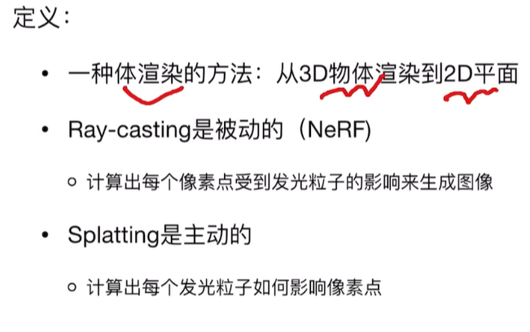
  - 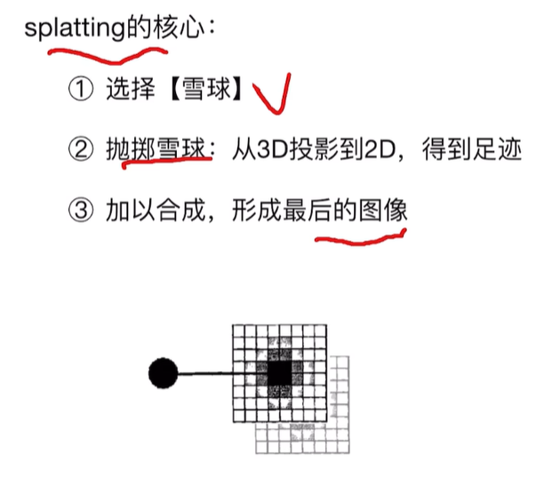
- **选择“雪球”**
  - 点云中的点没有体积
  - 所以需要一个核，以其为中心进行“膨胀”
  - 高斯核有很好的数学性质：
    - 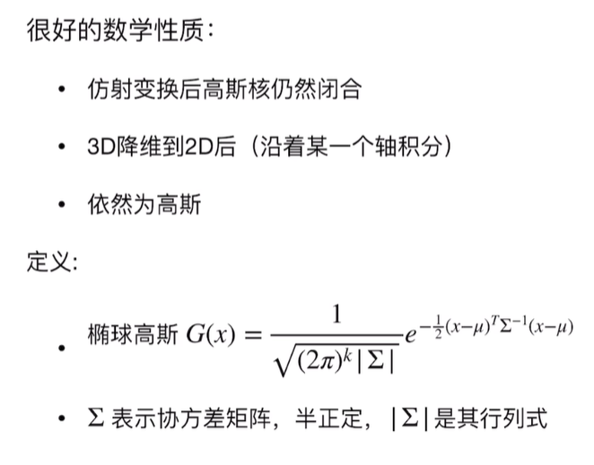
  - **3D高斯为椭球**
    - 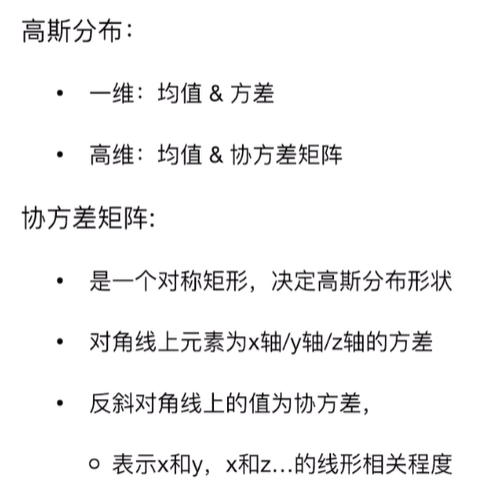
    - 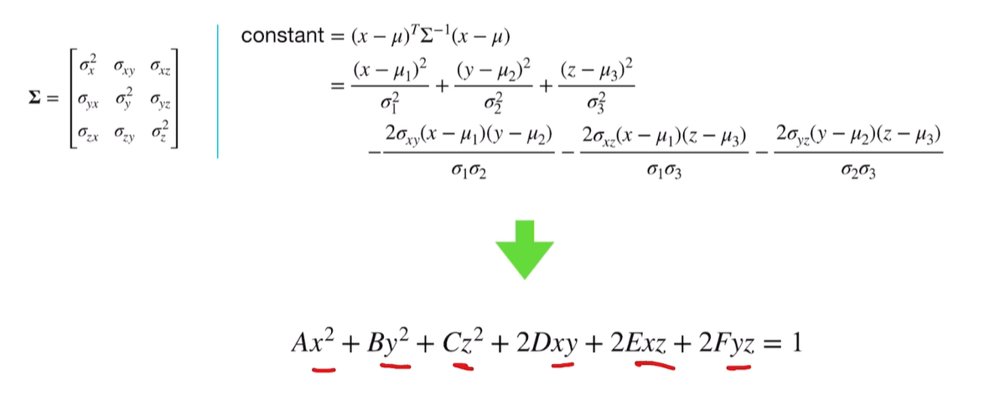
    - 当e的指数为定值（高斯函数取到某个取值时）高斯函数在三维空间中表现出一个椭球壳
    - 又因为高斯函数取值为0~1，所以高斯函数整体在三维空间中表现为实心的椭球
- **各向同性&各向异性**
  - 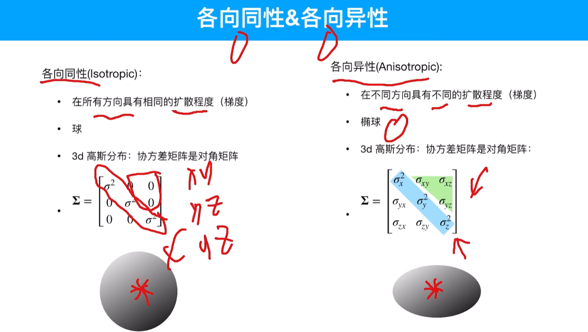
- **任意高斯可以看作是标准高斯通过仿射变换得到**
  - 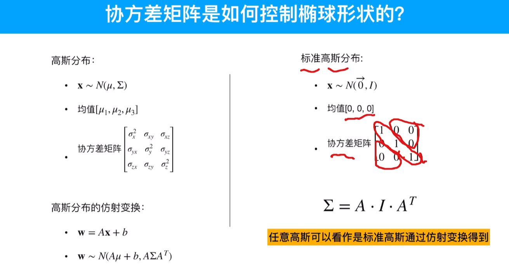
  - 3D高斯中正是协方差矩阵控制了高斯的形状
- **协方差矩阵因此可以使用旋转与缩放来表达**
  - 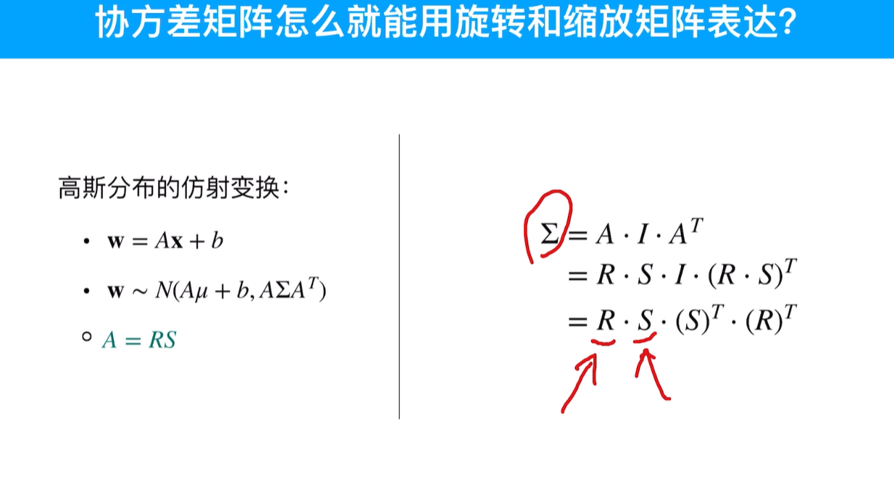
  - A为仿射变换矩阵，可以拆为旋转与缩放矩阵

### 从3D到像素 - 光栅化渲染管线
- 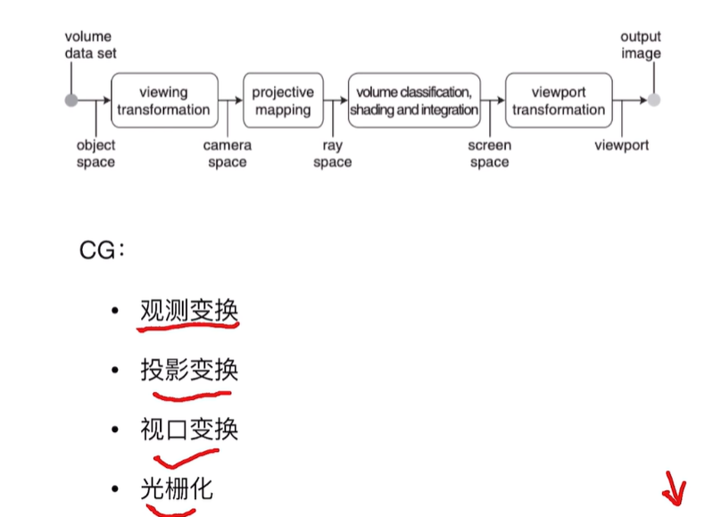
- 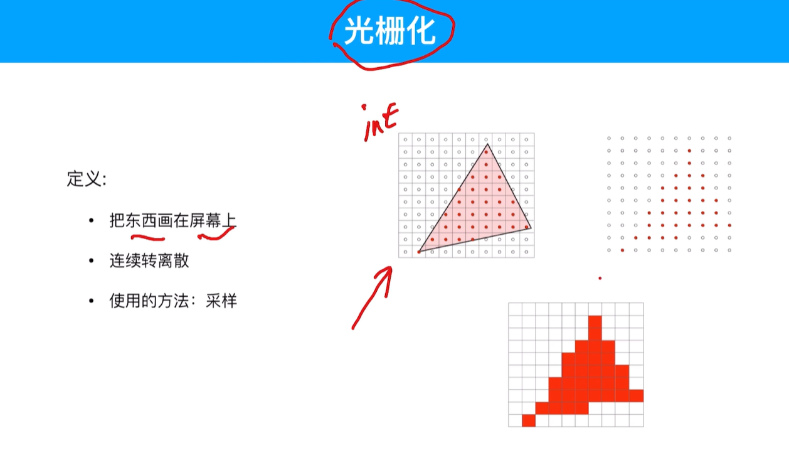

### 3D高斯的观测变换
- **3D高斯的核心即为其均值与协方差矩阵**
- 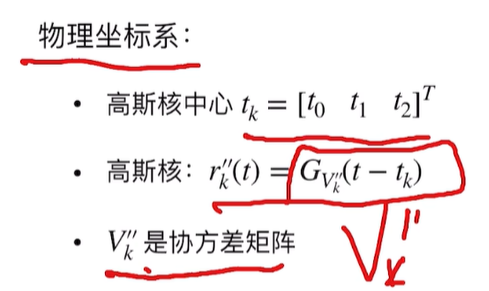
- **重点**
  - 对于协方差矩阵不可进行透视矩阵变换
  - 因为透视矩阵为非线性变换
  - 如果使用非线性变化会使得协方差矩阵形变

### 雅可比矩阵
- 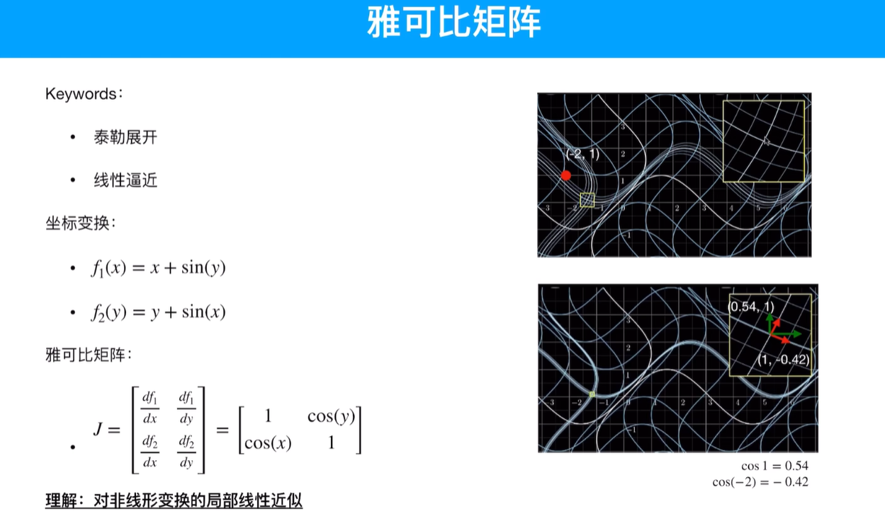
- 对非线性变换的局部线性近似
- 确定了一个点，即可使用*导数*在其附近足够小的位置进行线性逼近
- 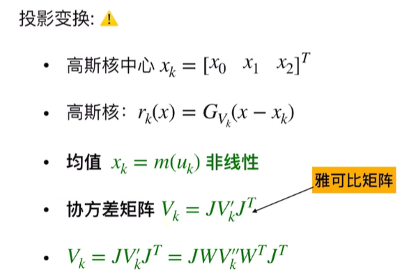
- 对协方差矩阵进行的投影变换近似
- 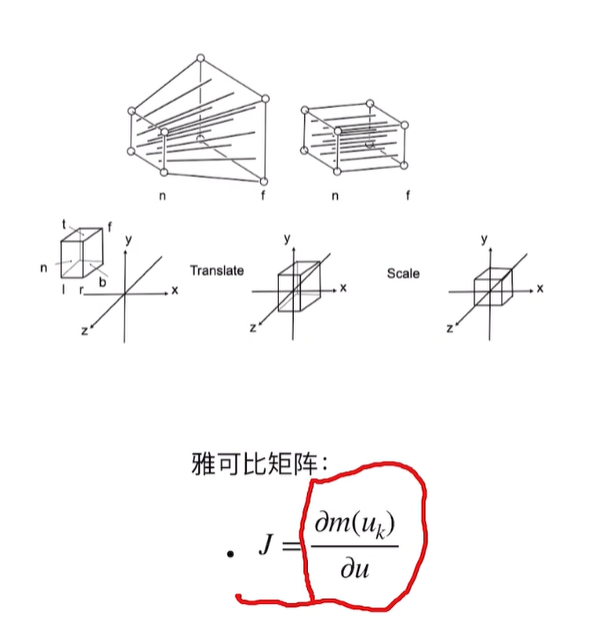
- 雅可比矩阵应用过程：
  - 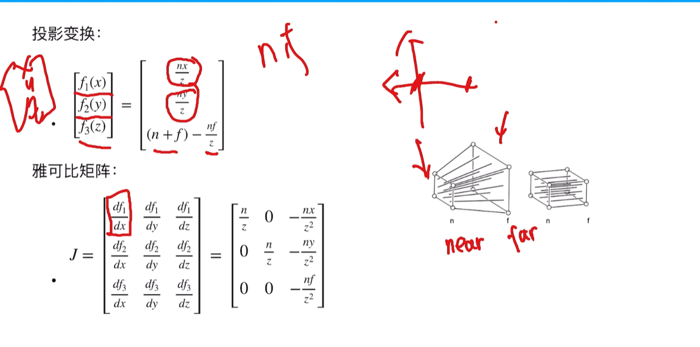