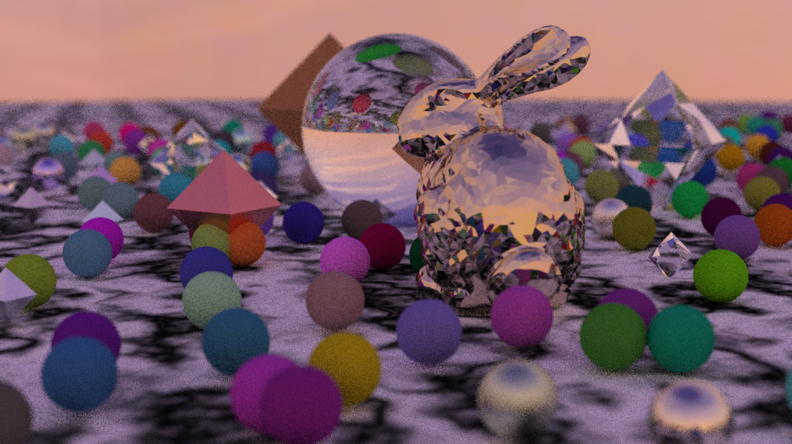
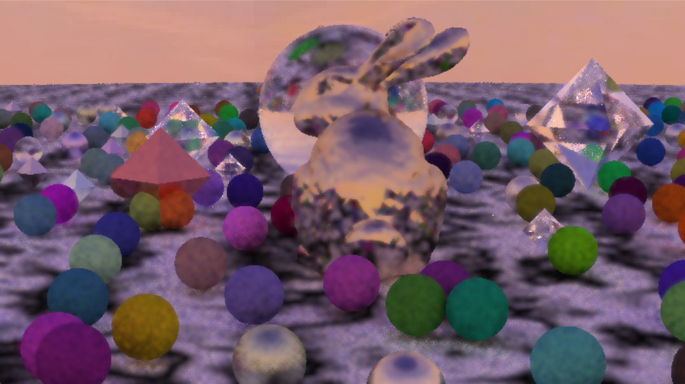

# Computer-Graphics-Project
This is a document for some graphics project.  
In this repositories,I will implement some basic graphics project.

# Ray Tracing

##  核心功能

###  渲染管线
- **光传输模型**
  - Lambertian (漫反射)、Metal (镜面反射)、Dielectric (玻璃折射)材质
  - 体积散射 (Constant Medium) 支持烟雾、雾等参与媒质
  - 发光材质 (Diffuse Light) 支持面光源和点光源
  - HDR纹理与贴图采样

- **环境光照**
  - 天空盒映射 (Skybox) 基于环境贴图的光照
  - **球谐光照** (Spherical Harmonics, SH) 低频环境光预计算
  - 支持多种图像格式 (PPM, JPG, PNG等)

###  几何加速
- **BVH (Bounding Volume Hierarchy)** 加速结构
  - SAH (Surface Area Heuristic) 自适应划分
  - 支持静态场景快速构建和查询
  - O(log n) 射线求交时间复杂度

- **基础几何体**
  - 球体、四边形、三角形、三角网格
  - 圆形与环形结构 (用于土星环等特殊效果)
  - 八面体等凸多面体
  - OBJ模型加载 (通过Assimp库)

###  采样与降噪

#### 采样策略
- **分层采样** (Stratified Sampling)
  - 网格化样本分布，降低锯齿与噪点
- **俄罗斯轮盘赌** (Russian Roulette)
  - 概率性路径终止，避免"黑点"伪影
  - 能量守恒的无偏估计量

#### 多层次降噪管线 (Linear Space Chain)
```
Raw Accumulation → Outlier Removal → Temporal Denoising → Spatial Denoising → Encoding
       (原始)           (中值检测)        (时间平滑)         (空间滤波)        (Gamma)
```

1. **Outlier Removal (异常值移除)**
   - 亮度中值滤波
   - 相对阈值 + 绝对阈值双重检测
   - 智能插值保留颜色色调

2. **Temporal Denoising (时间降噪)**
   - 指数移动平均 (EMA) 历史融合
   - **Back Projection** 运动补偿
   - 相机运动自动检测与G-Buffer驱动

3. **Spatial Denoising (空间降噪)**
   - **Joint Bilateral Filter**
   - 颜色、法线、深度多通道引导
   - 可配置滤波半径

4. **G-Buffer收集**
   - 深度 (Depth)、世界坐标 (Position)、法线 (Normal)、材质属性
   - 支持可视化调试 (深度图、法线图等)

###  实时渲染优化
- **Progressive Rendering (渐进式累积)**
  - 逐帧采样累积，实时反馈
  - 能量守恒的平均化
  - 可配置每帧采样数

- **Tile-based Parallel Rendering**
  - 32×32 Tile切分策略
  - 固定线程池 + 原子操作任务分派
  - Thread-local随机数生成器 (RNG) 避免竞争

- **单帧离线模式**
  - 高质量离线渲染输出
  - 进度窗口实时显示
  - 自动PPM文件存盘

###  相机与交互
- **相机运动**
  - 圆周轨道运动 (Orbital Motion)
  - 景深效果 (Depth of Field)
  - 焦点距离可配置

- **窗口实时显示**
  - 基于Windows GDI的高效渲染窗口

##  项目结构

```
Ray Tracing 3/
├── camera.h              # 核心渲染相机类、降噪管线、多线程调度
├── hittable.h            # 射线求交基类与接口
├── material.h            # 材质与BRDF定义
├── texture.h             # 纹理与环境贴图
├── spherical_harmonics.h # 球谐光照系数计算与存储
├── bvh.h                 # BVH加速结构
├── model_loader.h        # OBJ模型加载 (Assimp)
├── render_window.h       # Windows窗口渲染后端
├── color.h               # 颜色处理与Gamma校正
├── rtweekend.h           # 工具函数、随机数、常量定义
└── main.cc               # 多个场景示例与程序入口
```

##  未来改进方向

- [ ] GPU加速 (CUDA/OptiX)
- [ ] 实时光线跟踪 (Progressive Ray Tracing)
- [ ] 更多BRDF模型 (Oren-Nayar, Cook-Torrance)
- [ ] 焦散与参与媒质改进
- [ ] 多GPU分布式渲染

## 渲染效果展示

- 单张（1200*675）迭代累积10spp后效果(静止相机)


- 联合滤波（实时化）效果（运动相机）

！[alt text](picture/solar_system_redesigned.ppm)
- 渲染场景展示：太阳系