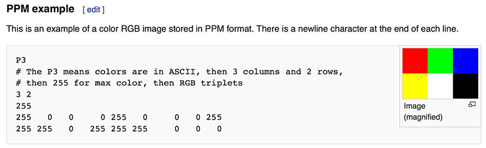

# Ray Tracing
**基于Ray tracing in one week实现光追渲染器**

## The PPM Image Format
- 
- 在这里遇到了一个问题，就是使用PowerShell的默认重定向导致出现了以 UTF-16 编码保存文件，导致PPM 文件无法正常显示。
- **修改方法**
  - 直接在C++中使用文件读写即可解决问题，而不是使用教程中的指定输出形式


## Cmake相关知识
### 1. **CMake 与 CMakeLists.txt 的关系**

* **CMake**：一个**跨平台的构建系统生成工具**，本身并不直接编译代码，而是**根据项目的配置文件（CMakeLists.txt）生成构建系统**（如 Makefile、Visual Studio 工程、Ninja 构建脚本等），然后再由对应构建系统去调用编译器完成编译。
* **CMakeLists.txt**：CMake 的**配置脚本文件**，使用 CMake 语法编写，告诉 CMake：

  * 项目有哪些源文件
  * 编译需要哪些库
  * 需要哪些编译选项
  * 最终如何链接生成可执行文件或库
* **关系总结**：

  > CMake 是工具，CMakeLists.txt 是它的说明书。没有 CMakeLists.txt，CMake 不知道怎么构建你的项目。

---

### 2. **CMake 的基本工作流程**

假设你有一个项目 `my_project`：

```
my_project/
├── CMakeLists.txt
├── main.cpp
└── src/
    └── utils.cpp
```

工作流程通常如下：

1. **编写 CMakeLists.txt**
   定义项目构建规则，比如：

   ```cmake
   cmake_minimum_required(VERSION 3.10)   # 最低CMake版本要求
   project(MyProject)                     # 项目名称
   add_executable(my_app main.cpp src/utils.cpp)  # 生成可执行文件
   ```

2. **运行 CMake 配置项目**

   * 在项目目录外创建一个构建目录（推荐 out-of-source build）：

     ```bash
     mkdir build
     cd build
     ```
   * 运行：

     ```bash
     cmake ..
     ```

     这一步：

     * 读取 `../CMakeLists.txt`
     * 根据平台、编译器、选项生成构建系统文件（如 Linux 下的 `Makefile`，Windows 下的 `.vcxproj`）。

3. **编译项目**

   * 使用生成的构建系统进行编译：

     ```bash
     cmake --build .
     ```

     或：

     ```bash
     make
     ```

     这一步才会调用 `g++`、`clang++`、`msbuild` 等实际编译器来编译源码。

---

### 3. **CMake 的优点**

* **跨平台**：一次配置，多平台构建（Windows、Linux、MacOS）。
* **可扩展**：支持添加自定义构建规则、外部库依赖等。
* **灵活性**：可以生成不同的构建系统（Makefile、Ninja、Visual Studio 工程等）。
* **分离构建目录**：避免源代码目录被临时编译文件污染。

---

## cmd与powershell

## 1. **联系**

* **都是 Windows 的命令行工具**，用于和系统交互。
* **都能运行批处理脚本**（.bat 或 .cmd）。
* **都可以执行外部程序**（如 `ping`, `ipconfig` 等）。
* **PowerShell 可以在一定程度上兼容 cmd 的命令**（很多 cmd 命令在 PowerShell 里直接输入也能用）。

---

## 2. **区别**

| 对比点      | **cmd（命令提示符）**            | **PowerShell**                                 |
| -------- | ------------------------- | ---------------------------------------------- |
| **定位**   | 传统命令行解释器（MS-DOS 时代延续）     | 面向系统管理与自动化的脚本环境                                |
| **命令集**  | 基于字符串的命令（如 `dir`, `copy`） | 基于 .NET 的命令（称为 *cmdlet*，如 `Get-ChildItem`）     |
| **脚本文件** | `.bat` / `.cmd`           | `.ps1`                                         |
| **数据处理** | 输出都是纯文本，需要自己解析            | 输出是 **对象**（可直接访问属性和方法）                         |
| **功能**   | 基本文件操作和简单系统命令             | 支持复杂系统管理（注册表、服务、进程、WMI、网络等）                    |
| **可扩展性** | 需要外部程序                    | 内置丰富模块，可直接调用 .NET API                          |
| **跨平台**  | 仅 Windows                 | PowerShell Core（7.x 版本）已支持 Windows、Linux、macOS |

---

## 3. **工作方式的核心区别**

* **cmd**：命令运行后，返回的是纯文本输出。例如：

  ```cmd
  dir
  ```

  返回一堆字符串，如果你想处理这些数据，得用字符串解析。

* **PowerShell**：命令运行后，返回的是**对象集合**。例如：

  ```powershell
  Get-ChildItem
  ```

  返回的是 `FileInfo`、`DirectoryInfo` 对象，可以直接用：

  ```powershell
  Get-ChildItem | Where-Object {$_.Length -gt 100KB}
  ```

  按文件大小直接筛选。

---

## 4. **什么时候用哪个？**

* **cmd**：运行一些旧脚本、批处理文件、简单命令。
* **PowerShell**：做系统管理、批量任务处理、复杂自动化、跨平台管理。

---